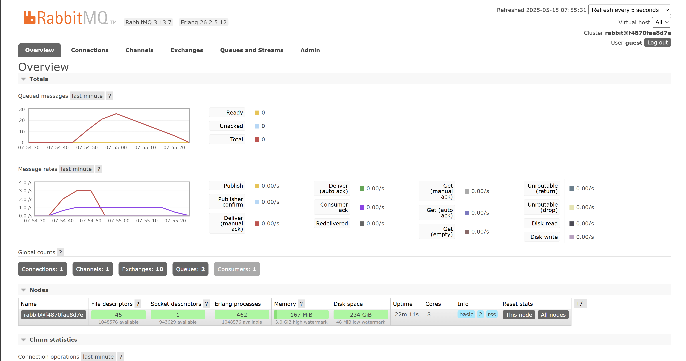

# Reflection 1

a. What is AMQP?

> AMQP (Advanced Message Queuing Protocol) serves as a communication protocol that allows applications to interact with compatible message brokers. It was developed to provide reliable, efficient, and versatile messaging capabilities.

b. What does guest:guest@localhost:5672 mean? What is the purpose of the first guest, the second guest, and localhost:5672?

> In this connection string, the first "guest" represents the username while the second "guest" is the password for accessing the RabbitMQ server. "localhost:5672" indicates the server location and port number, with 5672 being RabbitMQ's standard port.

Simulation slow subscriber

> The queue shown above contains accumulated messages because the publisher sends messages to the broker faster than the consumer can process them. Since the consumer operates more slowly, unprocessed messages remain stored in the queue awaiting consumption.